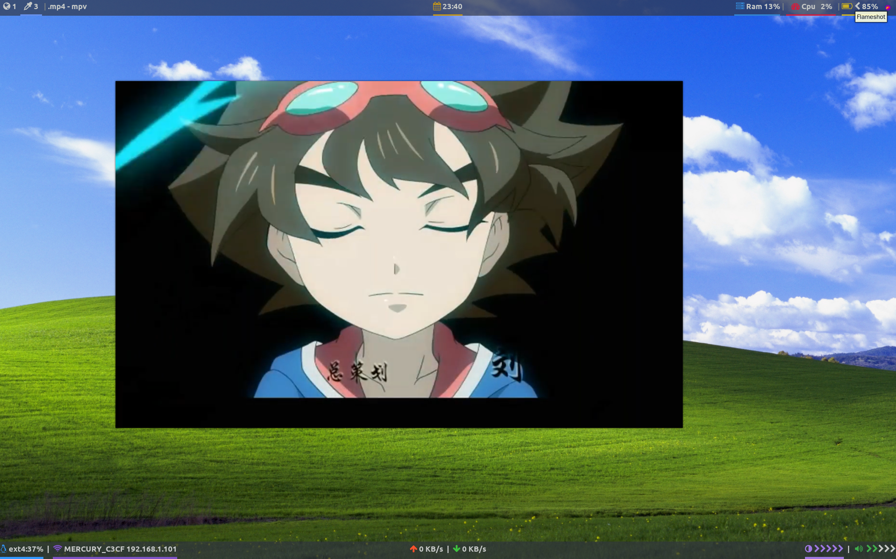
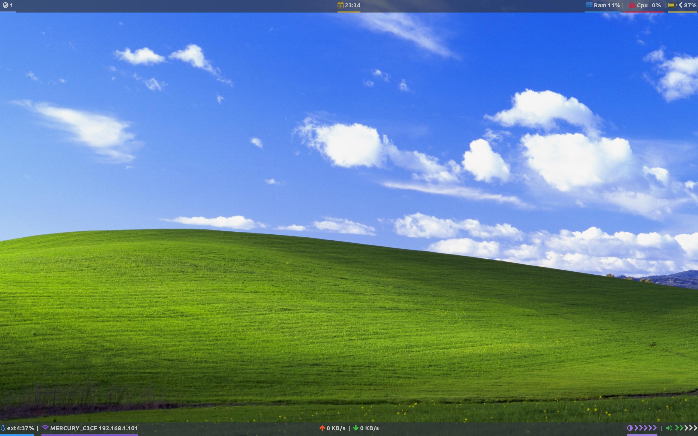
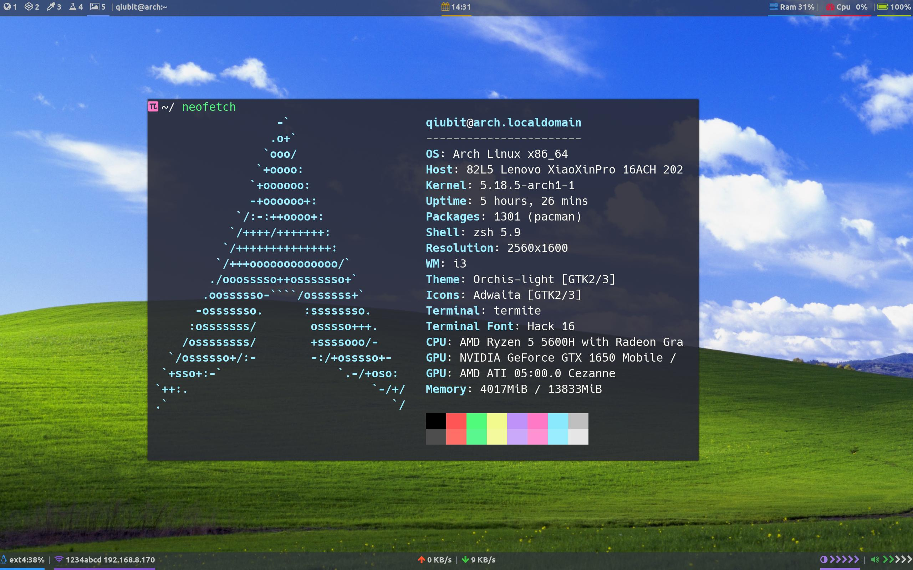

# dotfiles
my dotfiles for ArchLinux i3

## Screenshot





## 安装

**温馨提示：最好备份一下您的配置**

<details>
<summary>i3</summary>

这里使用`i3-gaps`

- 安装 `i3-gaps` 和 `picom`:
    ```shell
    $ sudo pacman -S i3-gaps picom
    ```
- 我的配置：
    ```shell
    ./i3
    ```
</details>

<details>
<summary>polybar</summary>

替换i3-state

- 安装 `polybar`:
    ```shell
    $ sudo pacman -S polybar
    ```
- 我的配置：
    ```shell
    ./polybar
    ```
</details>

<details>
<summary>rofi</summary>

- 安装 `rofi`:
    ```shell
    $ sudo pacman -S rofi
    ```
- 我的配置：
    ```shell
    ./rofi
    ```
</details>

<details>
<summary>termite</summary>

一款终端模拟器

- 安装 `termite`:
    ```shell
    # install termite from aur
    ```
- 我的配置：
    ```shell
    ./termite
    ```
</details>

<details>
<summary>dunst</summary>

一款通知管理工具

- 安装 `dunst`:
    ```shell
    $ sudo pacman -S dunst
    ```
- 我的配置：
    ```shell
    ./dunst
    ```
</details>

<details>
<summary>vim</summary>
这里使用 NeoVim

- 安装`nvim`:
    ```shell
    $ sudo pacman -S neovim
    ```
- 安装`packer.nvim`:
    ```shell
    $ git clone --depth 1 https://github.com/wbthomason/packer.nvim\ ~/.local/share/nvim/site/pack/packer/start/packer.nvim
    ```
- 替换配置
    ```shell
    $ cp -R ./nvim ~/.config/
    ```
- 安装插件
    ```shell
    # 打开nvim
    :PackerSync
    ```
</details>

<details>
<summary>xmodmap</summary>

用来管理按键映射

- 安装 `xorg-xmodmap`:
    ```shell
    $ sudo pacman -S xorg-xmodmap
    ```
- 创建键映射表：
    ```shell
    $ xmodmap -pke > ~/.Xmodmap
    ```

- 测试更改：
    ```shell
    $ xmodmap ~/.Xmodmap
    ```

- 激活：
    对于GDM、XDM或LightDM，不需要特别激活~/.Xmodmap。对于startx，请使用：
    ```shell
    ~/.xinitrc

    [[ -f ~/.Xmodmap ]] && xmodmap ~/.Xmodmap
    ```

- 我的键位：
    ```shell
    ./Xmodmap
    ```
</details>

<details>
<summary>ranger</summary>

一个tui的文件管理工具

- 安装 `ranger`:
    ```shell
    $ sudo pacman -S ranger
    ```
- 安装其他依赖以支持预览多种文件：
    ```shell
    $ highlight (pacman) # code highlight
    $ w3m (pacman) # preview HTML
    $ poppler (pacman) # preview PDF
    $ atool (pacman) # preview archive
    $ mediainfo (pacman) # preview multimedia file
    ```

- 生成配置：
    ```shell
    $ ranger --copy-config=all
    ```

- 我的配置：
    ```shell
    ./ranger
    ```
</details>

<details>
<summary>zathura</summary>

一款pdf查看工具

- 安装 `zathura`:
    ```shell
    $ sudo pacman -S zathura
    ```
- 安装其他插件：
    ```shell
    $ zathura-cb (pacman) # Comic book support
    $ zathura-djvu (pacman) # DjVu support
    $ zathura-pdf-mupdf (pacman) # EPUB, PDF and XPS support based on MuPDF
    $ zathura-ps (pacman) # PostScript support
    ```

- 生成配置：
    ```shell
    $ ranger --copy-config=all
    ```

- 我的配置：
    ```shell
    ./zathura
    ```
</details>