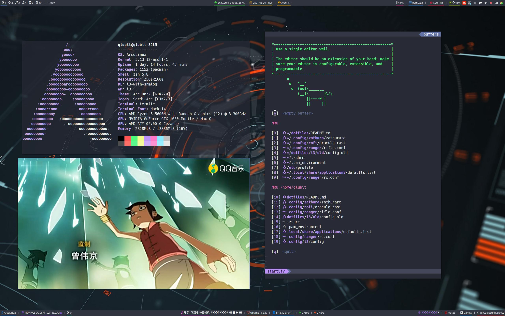
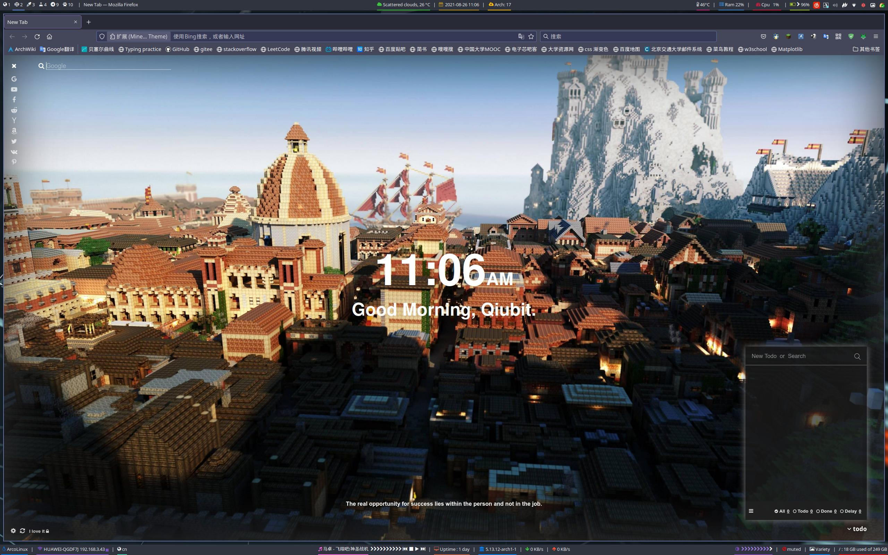
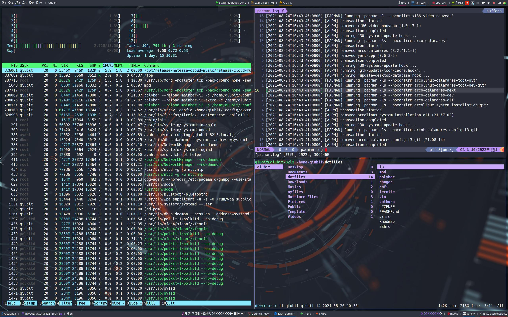

# dotfiles
my dotfiles for ArcoLinux i3

## Screenshot




## How to install

**At first, you'd better backup your own config files!!!**

### vim

install vim-plug

```shell
mv vim ~/.vim
mv vimrc ~/.vimrc
```

### xmodmap

install xkeycaps (pacman)

```shell
xmodmap -pke > ~/.Xmodmap
mv Xmodmap ~/.Xmodmap
```

### mpd

install mpd
install ncmpcpp or ncmpc which is an mpd client

```shell
mkdir ~/.config/mpd/playlists
touch ~/.config/mpd/{database,log,pid,state,sticker.sql}
```

copy the mpd/mpd.conf to ~/.config/mpd 


### ranger

install ranger and other plugs

```shell
highlight (pacman) # code highlight
w3m (pacman) # preview HTML
poppler (pacman) # preview PDF
atool (pacman) # preview archive
mediainfo (pacman) # preview multimedia file
```

generate config files

```shell
ranger --copy-config=all
```

### zathura

install the zathura package along with the desired optional dependencies

```shell
zathura-cb (pacman) # Comic book support
zathura-djvu (pacman) # DjVu support
zathura-pdf-mupdf (pacman) # EPUB, PDF and XPS support based on MuPDF
zathura-ps (pacman) # PostScript support
```
